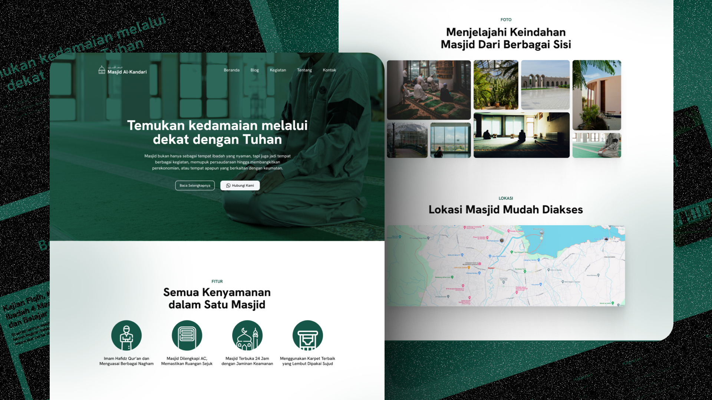

# Masjid Al-Kandari


This repository contains the landing page project for the Masjid Al-Kandari challenge, provided by [codedesign.dev](https://www.codedesign.dev). The goal of this challenge is to design and develop a modern, responsive landing page for Masjid Al-Kandari, incorporating aesthetics, user-friendly navigation, and clear information presentation.

## Details
The challenge involves creating an elegant, visually appealing landing page with the following key elements:

1. Responsive Design: Ensure that the landing page is accessible and displays correctly across different devices and screen sizes.
2. Hero Section: A well-designed hero section that introduces Masjid Al-Kandari with a relevant image and message.
3. Features: A section highlighting the key services or features provided by Masjid Al-Kandari.
4. Photo: Clearly present the mosque's photo details from various sides.
5. Location: Using [Maps.ie](https://www.maps.ie/create-google-map/) to show the location of masque with Google Maps API to include in iframe tag.

For more information on the challenge, visit the [challenge link](https://codedesign.dev/challenge/masjid-al-kandari).

## Tech Stack
- HTML5 & CSS3: For structuring and styling the landing page.
- JavaScript: For any dynamic interactions or animations.
- Tailwind CSS: To ensure responsive design and easy utility-based styling.
- ReactJS: JavaScript Library to build an interactive website.
- Vite: A build tool that aims to provide a faster and leaner development experience for modern web projects

## Installation
Follow these steps to install this project:
1. **Clone this Repository** :
```bash
git clone https://github.com/fathanmaul/al-kandari.git
cd al-kandari
```
2. **Install Depedencies**
```bash
npm install
```
3. **Running the Application**
```bash
npm run dev
```

This command will start a local development server and open your default browser to [http://localhost:5173](http://localhost:5173`).

## Deployment
This project is successfully deployed in Vercel. You can access the website within this link: [Al-Kandari](https://al-kandari.vercel.app/)

## Thanks to the Designer
A big thanks to the designer who crafted the vision for Masjid Al-Kandari. Their creative direction and design inspiration served as the foundation for this project. Without their valuable contributions, this landing page wouldn't be possible.

For more of their work, check out their portfolio [here](https://www.figma.com/@fdhlnrzzmn)

## Contribution
If you'd like to contribute to this project, whether by reporting bugs or suggesting improvements, feel free to open an issue or submit a pull request (PR). Contributions are always welcome, and you can help enhance the project by adding features, fixing bugs, or improving the documentation.

## Credits
- [Code Design](https://codedesign.dev/)
- [React](https://reactjs.org/)
- [Vite](https://vitejs.dev/)
- [Tailwind CSS](https://tailwindcss.com/)
- [React Icons](https://react-icons.github.io/react-icons/)

If you have any questions or feedback, feel free to reach out to me at [fthnmrh012@gmail.com](mailto:fthnmrh012@gmail.com)
